# MetricsPro — Tenant Onboarding Workflow (designed from requirements)

Author: workflow architect (on request of the owner, 2026-09-20)
Scope: the flow a new dealer group (or an implementer on their behalf) walks once, and re-walks in part every month. Designed from what the business needs; no existing onboarding code was consulted. Destination facts (which tables the platform actually reads) come from `docs/SYSTEM_DATA_FLOW_INDEX.md` §2–§5.

## 0. Design principles (the contract every stage obeys)

1. **One shape for every data stage.** Upload → the platform reads the file and pre-fills everything it can → the user confirms only what a file cannot say → identity resolution (store, rep, account) with zero unresolved allowed → our numbers beside the file's numbers → the tenant confirms. A stage is "verified" only after the confirm click, and only when the numbers shown were non-zero or the tenant explicitly attested "this is legitimately zero" with a reason.
2. **Always know where you are.** A left rail lists Stage 1–5 with sub-steps and a status lamp (not started / in progress / needs input / verified). The rail is rendered from persisted state, so reopening the browser lands on the first non-verified step. Every hand-off to another screen carries a `return_to` and shows a "Back to onboarding — step 3.6" banner on that screen.
3. **Prefill with provenance.** Every pre-filled value shows where it came from: *from your file*, *house default for <carrier the tenant chose>*, *your earlier choice (statement of <month>)*. There is no fourth provenance. There is never a prefill from a carrier the tenant did not select.
4. **RULE TWO — config, never code.** Carriers, POS systems, statement types, label buckets, sign conventions, store aliases, account→store maps are all rows scoped to the org (with house-org preset rows keyed by carrier/POS code). "Onboard a carrier the codebase has never heard of" means: insert a `commcalc.carrier` row with a slug and display name, and let the flow learn its mapping from the file.
5. **What we show is what we use.** The mapping the user confirms is the row the ingest reads. One mapping row per source; the verify screen recomputes from the landed rows, not from the in-memory parse.
6. **Numbers before "done".** The word "complete" appears only on the Verify stage, and only after each source's computed total has been shown next to the file's own total and confirmed.

## 1. The flowchart

```mermaid
flowchart TD
  S0([Open Onboarding]) --> R{Saved run for this org?}
  R -- no --> A1
  R -- yes --> J[Jump to first non-verified step<br/>rail shows all stages + status]
  J --> A1

  subgraph A["Stage 1 — Company setup"]
    A1["1.1 Dealer group + companies (legal entities)"] --> A2["1.2 Stores per company<br/>(code, name, address, company, market)"]
    A2 --> A3["1.3 Carriers sold (per company)"]
    A3 --> A3q{Carrier in the list?}
    A3q -- no --> A3n["Create carrier row<br/>(display name → slug); no preset"] --> A3
    A3q -- yes --> A4["1.4 POS per company (RQ, B2B, other → new POS row)"]
    A4 --> A5{"Every store has a company,<br/>≥1 carrier, a POS?"}
    A5 -- no --> A2
    A5 -- yes --> AV["1.V Verify: N companies / N stores / N carriers / N POS<br/>tenant confirms the roster"]
  end

  AV --> B0
  subgraph B["Stage 2 — Sales & inventory (per POS source)"]
    B0["2.0 Pick next POS source without a verified sales file"] --> B1["2.1 Upload sales export (any layout)"]
    B1 --> B2["2.2 Platform reads sheets, header row, footer;<br/>proposes column map with provenance"]
    B2 --> B3["2.3 Confirm map: store, rep, date, trans id,<br/>amount, GP, void flag, contract type, dept/category"]
    B3 --> B4["2.4 Store strings → store codes; rep strings → employees"]
    B4 --> B4q{All store strings resolved?}
    B4q -- no --> B4f["Assign, create store, or mark 'not ours' (recorded)"] --> B4
    B4q -- yes --> B5["2.5 Verify: rows, distinct txns, Σ amount, Σ GP,<br/>date span, per-store counts — beside file totals"]
    B5 --> B5q{Totals match?}
    B5q -- no --> B5d["Show the gap and the rows behind it"] --> B3
    B5q -- yes --> B6["2.6 Upload inventory export (or record 'none')"]
    B6 --> B7["2.7 Map + store resolve (same as 2.3–2.4)"]
    B7 --> B8{Units + Σ cost match file?}
    B8 -- no --> B7
    B8 -- yes --> B9{Another POS source / company file?}
    B9 -- yes --> B0
  end
  B9 -- no --> C0

  subgraph C["Stage 3 — Commission statement, per carrier (loop)"]
    C0["3.0 Pick next carrier (× statement type)<br/>without a verified statement"] --> C1["3.1 Upload statement"]
    C1 --> C2["3.2 Detect sheet, header row, footer/total row, columns"]
    C2 --> C3["3.3 Confirm amount column, label column, period/date,<br/>store or account column, MDN/IMEI"]
    C3 --> C4["3.4 SIGN: 'In this file, is money you EARNED<br/>positive or negative?' + 3 real rows each way"]
    C4 --> C5["3.5 Detect distinct labels with count, Σ, sign mix"]
    C5 --> C6["3.6 Assign every label to one of 5 buckets<br/>(+ reversal flag)"]
    C6 --> C6q{Any label unassigned?}
    C6q -- yes --> C6
    C6q -- no --> C7["3.7 Store / account → store attribution"]
    C7 --> C7q{All accounts resolved?}
    C7q -- no --> C7
    C7q -- yes --> C8["3.8 Bucket totals (gross / chargebacks / net)<br/>beside the file's own total"]
    C8 --> C8q{Totals match?}
    C8q -- no --> C8d["Show gap: dropped rows, unbucketed,<br/>sign anomalies, footer"] --> C3
    C8q -- yes --> C9["3.9 Tenant confirms this statement"]
    C9 --> C10{Another carrier or<br/>another statement type?}
    C10 -- yes --> C0
  end
  C10 -- no --> D1

  subgraph D["Stage 4 — Verify everything"]
    D1["4.1 One table: every source, period, our total,<br/>file total, verified by, when"] --> D2{All rows green?}
    D2 -- no --> D3["Open the red row → jumps to its step"]
    D2 -- yes --> D4["4.2 Sign-off (name, role, on-behalf flag)"]
  end
  D3 -. returns to .-> B0
  D3 -. returns to .-> C0

  subgraph E["Stage 5 — Done"]
    D4 --> E1["Monthly runbook: what to upload, where it lands,<br/>links to Sales report + Commissions"]
    E1 --> E2["Monthly intake = Stages 2–3 only,<br/>same rail, mappings pre-applied"]
  end
```



## 2. Per stage

### Stage 1 — Company setup
- User sees: a roster builder: dealer group → companies → stores (table) → carriers (chips per company) → POS (per company).
- Input: company legal name; store code/name/address/company/market; carriers per company (pick or create); POS per company (pick or create). A store list spreadsheet can be uploaded to pre-fill.
- System: writes org hierarchy rows, `commcalc.carrier` rows per org (new carrier = slug + display name, no preset), POS rows. No data ingested yet.
- Exit: ≥1 company, ≥1 store, every store has a company, every company has ≥1 carrier and a POS.
- Verify: "3 companies, 24 stores, 2 carriers, 1 POS". Stores missing a carrier or POS are listed red and block exit.

### Stage 2 — Sales & inventory (per POS source)
- User sees: dropzone → three-column mapping screen (platform field / your column, pre-selected / provenance + 3 sample values) → store-resolution list → verify card.
- Input: confirm/adjust the fields the platform reads (`raw_sales` / `daily_sales_feed` columns). Header row and sheet choice shown and overridable.
- System: reads ALL sheets; continuation sheets with identical headers are appended; drops header echoes and a detected grand-total footer. Proposes map from house preset for the chosen POS code → header heuristics. Computes header fingerprint. Resolves store strings via the org's canonical store map. Lands rows for the period derived from each row's own date, replacing only the slice the file owns.
- Exit: 0 unresolved store strings; totals confirmed.
- Verify: rows parsed vs data rows; distinct trans ids; Σ amount; Σ GP; date span; voided count; per-store and per-rep counts; file total if a footer exists (else the tenant may type the POS month total — recorded as "typed"). Match = to the cent.
- Inventory (2.6–2.8): same shape. Lands into `inventory_aging_device`. "No inventory export" is an explicit recorded choice.

### Stage 3 — Commission statement per carrier
See §3. Exit: sign confirmed, every label bucketed, every store/account resolved, Σ canonical = file total, tenant confirmed.

### Stage 4 — Verify everything
- One table: Source · Period · Our total · File total · Diff · Status · Verified by · When. Red rows link to the exact step with the diff pre-loaded.
- Cross-checks below (informational): commission lines whose MDN/IMEI is not in sales; stores with sales but no commission and vice versa.
- Exit: all rows green; sign-off recorded (name, role, on-behalf flag). Numbers recomputed from landed rows at sign-off, so a re-upload after a confirm turns its row red again.

### Stage 5 — Done
- Monthly runbook generated from what was configured, with links to Sales report and Commissions. "Start next month's intake" = stages 2–3 only.

## 3. The commission-statement stage in detail (3.1–3.9)

**3.1 Upload.** xlsx/xls/csv. Carrier pre-selected from Stage 1; statement type (default "commission statement"; a carrier that sends separate residual/spiff files gets a second type — a row, not a branch).

**3.2 Detect.** All sheets read; the sheet with the widest consistent header block is picked; header row = first row where ≥60% of cells are non-numeric strings and the next row is mostly populated; footer = last row whose label contains "total"/"grand" or whose only amount equals Σ of the column above. Sheet, header row, footer (with its value) and data row count are shown and overridable.

**3.3 Confirm columns.** amount, label, period/date, store or account id, MDN, IMEI. If several money columns exist, each is shown with Σ and the user picks the commission amount; the others are recorded as ignored with their Σ.

**3.4 Sign convention — asked plainly.**
> "In this file, is money you EARNED positive or negative?"  [ Earned is positive ] [ Earned is negative ]

Under it, two panels of three real rows each: the three largest positives and the three largest negatives, with label and store. Stored as `earned_sign ∈ {+1, −1}` on the (org, carrier, statement type) mapping row. Canonical amount = raw × earned_sign, applied once at ingest. Sanity check: if the commission bucket nets negative, or a reversal-flagged label nets positive, a yellow banner says "Your sign choice makes chargebacks positive — re-check 3.4". No default; must be answered once per statement type; later months reuse and display it.

**3.5 Detect labels.** Distinct label values with row count, Σ raw, Σ canonical, sign mix. Sorted by |Σ| descending.

**3.6 Bucket the labels.** Five columns: commission · spiff · equipment rebate · residual-monthly · autopay residual. Every label is a card in an "Unassigned" tray; drag or dropdown. Pre-placement provenance: house preset for THIS carrier code (exact label match) → tenant's own previous months → neutral keyword hint flagged "guess". Each card carries a reversal flag (pre-set when the label contains chargeback/reversal/clawback/deact or its sign mix is all-negative after normalisation). A reversal goes into the bucket it reverses. Exit gate: Unassigned tray empty. There is no "other" bucket.

**How a reversal is booked so it never inflates earnings.** After sign normalisation a chargeback has a negative canonical amount. It lands in the same bucket as its label with `is_reversal = true`. Bucket totals = gross earned (Σ positive), chargebacks (Σ negative), net. Downstream reads net. The platform never takes an absolute value and never stores a reversal as a positive under another label. When MDN/IMEI is present the reversal links to the original line; when absent it stays a store-level contra in its bucket.

**3.7 Store / account attribution.** Store names → same resolver as Stage 2. Carrier account ids → account→store map screen; each unresolved id with Σ and count; pick a store, create one, or mark "company-level". Exit gate: none unresolved.

**3.8 Totals.**
```
                     gross       chargebacks     net
commission        94,861.81      -3,120.40    91,741.41
spiff             18,061.37        -410.00    17,651.37
equipment rebate  ...
residual-monthly  35,490.67           0.00    35,490.67
autopay residual  ...
----------------------------------------------------------
Σ canonical (all buckets)                    xxx,xxx.xx
File's own total (footer row 1,204)           xxx,xxx.xx
Difference                                          0.00
Rows in file: 1,203 data + 1 footer + 0 blank; rows landed: 1,203
Ignored money columns: "Device Margin" Σ -8,179.68 (recorded)
```
Match = zero difference to the cent. A mismatch shows the rows behind it: dropped rows, unparseable amounts, sign anomalies, footer.

**3.9 Confirm.** "Confirm <carrier> — <month> — net $X". Records who, when, and the numbers. Then "Another carrier?".

## 4. State model

Tables (all org-scoped; house-org rows are presets):
- `onboarding_run` — org_id, run_kind ('initial'|'monthly'), period, status, current_step, started_by/at, signed_off_by, signed_off_on_behalf, signed_off_at.
- `onboarding_stage_state` — run_id, stage, step, instance_key (company / POS source / carrier+statement type / period), status ('not_started'|'in_progress'|'needs_input'|'verified'), payload jsonb, verified_numbers jsonb, verified_by/at, blocking_reason. The rail is a projection of this table.
- `source_mapping` — org_id, source_kind ('sales'|'inventory'|'commission'), pos_id or carrier_id, statement_type, sheet_rule, header_row_rule, footer_rule, column_map jsonb, earned_sign (+1/−1, commission only), ignored_money_columns jsonb, header_fingerprint, provenance jsonb, confirmed_by/at. One row per source; ingest reads THIS row. *(Built as: the EXISTING `commcalc.column_mapping` rows keyed by (org, `commission_ledger__<statement type>`, carrier, field) — `commission_ledger.mapping_report_key` derives the key, the sign lives on the amount row (mig 1006/1008); index §30.10. No new table.)*
- `label_bucket` — org_id, carrier_id, statement_type, label_text (normalised), bucket, is_reversal, provenance, confirmed_by/at. House-org rows of the same shape are the carrier presets.
- `store_alias` / `account_store_map` / `rep_alias` — identity resolutions confirmed in 2.4, 3.7.
- `onboarding_zero_attestation` — stage_state_id, reason, by, at — the only way a zero total can be verified.

"Complete" per stage: Stage 1 roster confirmed; Stage 2/3 per instance: mapping confirmed, 0 unresolved identities, diff = 0 (or attested), confirm recorded, rows landed and the recompute from landed rows equals verified_numbers; Stage 4: every instance verified and sign-off recorded.

Leaving and resuming: every screen writes payload on change and current_step on navigation. Reopen → first non-verified step. Hand-offs carry return_to and the target shows a return banner.

Second carrier: Stage 3 is keyed by instance. Nothing from carrier A's mapping, sign, or labels prefills carrier B.

New month: a `monthly` run with stages 2–3 (and 4). If the file's header fingerprint matches, the mapping auto-applies and the flow jumps to identity resolution and verify; new labels reopen 3.6 for the delta only; the sign answer is reused and displayed. A different fingerprint reopens the mapping step with a diff. Re-uploading a period replaces only that source's slice and turns its Stage-4 row red until re-verified.

## 5. What must NOT happen (foreclosed by design)

1. Silent fallback to another carrier's rules — provenance has three sources and none is "another carrier".
2. Mapping that displays one thing and uses another — one mapping row per source; verify recomputes from landed rows.
3. A totals screen reading $0.00 and calling itself done — verified requires diff = 0 against a non-zero file total, or an attestation with a reason and a name.
4. Dead-end hand-offs — every navigation away carries return_to and shows a return banner.
5. Footer/subtotal rows double-counting — footer detection shown and overridable; its value is the file total compared against.
6. Continuation sheets silently dropped — all sheets read; sheets and rows per sheet displayed.
7. Unresolved store/account strings landing as "Default" — zero-unresolved is an exit gate.
8. Chargebacks inflating earnings — sign normalised once; reversals negative in their bucket; net downstream; no abs().
9. A money column ignored without a trace — every non-selected money column recorded with its Σ.
10. Losing your place — state persisted per change; the rail is a projection of persisted state.
11. A label nobody classified booking to no bucket — no "other" bucket; tray must be empty to exit 3.6.
12. Carrier names in code — new carrier = row; presets = house rows keyed by code.

## 6. Open questions for the owner (only the ones that change the design)

1. Who may sign off Stage 4? Default: tenant admin OR implementer, by name, with an "on behalf" flag.
2. Match tolerance. Default: exact to the cent; "accept with a reason" records the difference, reason and name.
3. Chargeback bucket. Default: contra inside the bucket it reverses, not a sixth bucket; views show gross / chargebacks / net.
4. Multiple statement files per carrier per month. Default: allowed; each is its own statement type.
5. Statements keyed by carrier account id rather than store. Default: account→store map captured in 3.7 and reused monthly.
6. Is inventory mandatory? Default: optional, but "no inventory export" is an explicit recorded choice.
7. How much history at onboarding? Default: most recent closed month per source, then monthly.
8. Period for a statement that spans two months. Default: derive from the statement's own dates; ask once per statement type only when it spans two months.

## Critical files for implementation
- docs/SYSTEM_DATA_FLOW_INDEX.md (§2 destination tables; §13a store resolution contract)
- database/migrations/ (new numbered migrations for onboarding_run, onboarding_stage_state, source_mapping, label_bucket, account_store_map, onboarding_zero_attestation)
- backend/app/modules/commcalc/multisheet.py and feed_shape.py (existing pure sheet/footer/date shape rules to reuse)
- backend/app/modules/commcalc/report_labels.py (normalize_carrier_code / default_carrier — the one carrier resolver presets key off)
- frontend/src/components/ScreenLink.tsx (the one mechanism for named-screen hand-offs; return_to rides it)

## 7. Report availability is DERIVED from the tenant's declaration — never listed (owner directive 2026-09-20)

Owner: *"it is very important that we don't have extra file upload paths for a new tenant who does not need
those based on the carrier they pick. Our system should be smart enough to only show those which are
carrier-specific once they have been defined by a previous tenant or us on the back end … no patchwork, it
should work as a design. Currently in the Verizon tenant we have all the table uploads for B2B when it has
been declared that the POS is not B2B, it is RQ."*

**The rule.** A tenant never sees an upload path they cannot use. What they see is COMPUTED, on every
surface, from three facts they (or the house) have already given — never from a hardcoded list:

1. **What the tenant declared in Stage 1** — their POS system(s) and their carrier(s), per company.
2. **The report-kind registry** — ONE table (config rows, RULE TWO) of every report kind the platform can
   take, each row saying what it *applies to*: a POS code, a carrier code, or "any". A POS export applies
   to that POS; a carrier statement applies to that carrier; an X-report applies to any POS that produces
   one; a merchant report applies to any.
3. **Who has defined it** — a report kind is *available* only once it is DEFINED: seeded by the house, or
   confirmed by a previous tenant's completed intake (which also writes the learned header signature, §2/§6
   of the cards design). A carrier-specific report nobody has ever mapped is not offered; it is discovered
   through "Something else" and, once confirmed, becomes available to every later tenant on that carrier.

**Visible to a tenant = registry rows whose applies-to intersects the tenant's declaration AND that are
defined.** Nothing else. A tenant that declared RQ never sees a B2B export card, table, pattern or tile.

**One fact, one home, every surface.** The registry is the single source; every place that offers an
upload DEREFERENCES it through one visibility function (the existing `carrier_visible` / `posVisible`
family, extended to report kinds), never a copy:
- the intake's "What do you have?" cards (2.0),
- the upload wizard's table/report list,
- the email auto-import filename patterns and its "apply standard" presets,
- the configurations page's upload tiles,
- the navigation tiles already gated by #234,
- any future surface.

**Locked so it cannot un-wire.** A build-failing check enumerates every surface that renders an upload
choice and asserts it calls the one visibility function against the registry; a second list of report
kinds anywhere in code fails the build. A super-admin may widen a tenant's set through the existing
override (the `cap` scope), and the widening is recorded — it is config, not code.

**Why this is a design and not a filter.** The 2026-09 defect was fixed on the navigation tiles (#234) and
left every other upload surface unfixed — the same defect wearing a hat. A rule that lives in one function
and is enforced by a check is the only shape that stays fixed when the next surface is added.

## 8. A landed row says which report KIND wrote it; a replace is store × dates × KIND (owner 2026-09-20)

Owner: *"the data is not flowing into the exec mtd from wherever it is uploaded."* Measured on the first tenant to walk
Stage 2 twice: the line-level sales export (48,875 rows) and the by-product aggregate (10,823 rows) both landed in the same
table for the same store × date span, and the second landing's slice replace — store × dates — deleted the first. Nothing
had recorded which report kind wrote which row, so nothing could scope the replace to it.

**The rule.** Every row a Stage-2 (or any) landing writes carries the report kind that wrote it — the column-mapping layout
key — in the table's kind column (`landing_identity.KIND_STAMP`: ONE home of "which column, which default"). The slice a
file owns is **store × dates × kind**. A landing NEVER deletes rows of another kind silently: when another kind's rows sit
in its slice it is refused (nothing written, traced) with the loss in plain words — *"This would replace 48,875 rows of
'Sales report with IMEI and phone number' with 10,823 rows of 'Sales report with cost and selling price' …"* — and lands
only when the person confirms at 2.6 (the loss is then recorded, never implied). A row landed before this rule (NULL) reads
as the table's default kind, so nothing existing changes meaning.

**Two kinds that answer different questions never share a table.** The by-product aggregate (cost and selling price per
product) double-counts against line-level rows if summed and replaces them if landed beside them; it lands in its OWN table
(`raw_sales_product`, mig 1011). "Which table a layout lands in" has one home (`column_mapping.TABLE_MAP`) and every path
dereferences it; a caller cannot point a layout elsewhere.

**A landing nobody can read is not a landing.** Every landing table has a registered list of readers and the fields each
needs (`landing_identity.CONSUMERS`). A frame blank on every field a gating reader needs (the Executive MTD's department /
category / product name) is refused BEFORE a row is written, naming the reader and the fields — never accepted into a table
where it counts as nothing.

## 9. Every upload says where it shows up (owner 2026-09-20)

Owner: *"it should be mentioned on the upload page where this upload will be reflected, with a link. If the user does not
know and uploads the data it does no good."*

**The rule.** Every surface that offers an upload — the intake's 2.0 cards and 2.1 drop, the 2.6 result, the Stage-5
runbook, the Upload page's tiles, the Upload wizard's steps, the Email and FTP import routes — says *"This upload will show
in: [Executive MTD] [Sales Report] [Gross Profit] …"* with each name a link. The list is DERIVED from one chain — the
report-kind registry row → the table its landing writes → that table's registered readers — never typed on a surface; the
links are the platform's one screen → page mechanism (ScreenLink), gated by the reader's own permissions. A report page that
has rows but nothing to count, or no rows, links BACK the same way: which report kind feeds it, and the page to upload it on.

**A wrong file is told the right page.** When a file does not fit the tile it was dropped on, the registry's own detection
runs over its header row first and the refusal opens with *"This looks like a 'Cash register / X-report'. Upload it under
Onboarding — Commission Intake."*; the column list is the second line, never the only one.

**Locked.** `backend/harness_landing_identity_lock.py` fails the build when a writer to a multi-kind table stops stamping the
kind, when a second consumers map appears anywhere, when an upload surface stops rendering the one component, or when a
reader named in the map has no page to link to.

## 10. What counts as an activation is MAPPED from the file's own words — one predicate, everywhere (owner 2026-09-21)

Owner: *"sales report shows 88 txns but not a break up in to activations and upgrade etc, also nothing on exec mtd"*.
Measured on the first tenant whose POS export has no contract-type column: the activation type sat in the category path
leaf and the product name; every report and every commission calculation read zero activations, silently.

**The rule.** A sale line's activation type (new activation / upgrade / bring-your-own-device / port-in / hardware only) is
decided by ONE predicate (`commcalc/line_class.activation_class`) over the org's own rules: WHICH columns carry the type and
WHICH words name each class — config rows with house defaults (`accessory_config.activation_details_rules`), never a column
name or a word in code. Every surface that counts an activation — the Sales Report, Executive MTD, Daily Targets, every
commission calculation, the closing recon, the event register — dereferences that predicate. Two answers to "is this line an
activation" is the duplicate defect; the build fails on a second one (`backend/harness_line_class_lock.py`).

**Stage 2 asks it — step 2.5a "What counts as an activation".** After the numbers (2.5) and before the confirm (2.6), the
platform scans the file's distinct values per column, proposes the words that name each type from a generic hint vocabulary
(a word that appears on nearly every line is a department, not a type — reported, never proposed), shows the column each word
lives in, sample values and the count it would classify — computed by the predicate itself, so what the person confirms is
what every report will count. The same step maps the Executive MTD's line columns (phones, bill payments, protection …) where
their rule matches nothing. Accept or edit, save: the two existing config homes are written through their one writer each,
and the landed rows are re-counted.

**The gate.** A landed sales export whose rows cannot be told apart as any activation type is landed but NOT verified in
Stage 4 until a rule classifies at least one line or the person attests, with a reason and their name, that the file truly
has no activations. The Executive MTD page says the same thing in its own words and links to the step (ScreenLink) — the rows
are already there; nothing is re-uploaded.

**Compatibility.** The house defaults ARE the retired classifiers (contract type only, the same token lists): every existing
tenant's classification and pay are byte-identical (`backend/harness_line_class.py` replays the retired code over every
spelling in the seeds). Index §30.12 has the measured numbers and the file list.

**The effective rule IS what the person confirmed (2026-09-21 addendum).** The first tenant save put the bare word
"activation" — inside every category path of the export — under new activation, and every invoice counted as one: the silent
zero's twin. Three rules close it, each for every caller:

- **The guard runs over what is SAVED.** The save resolves the rules that would be in force exactly as the loader does and
  measures every word over the rows in hand (the landed rows, or the rows the kept file would land); a word naming nearly every
  line (≥ 80%) is REFUSED — nothing written, the word named with its class and share — unless the person ticks *keep this word
  anyway*, an attestation by name recorded in the same config. What is already saved is re-validated the same way on every
  open, on the commit and on the Executive MTD page: a refused rule blocks verification, the Stage-4 row reads *rule refused —
  "…" names 95% of the lines*, never a split, and the page opens in the refusal state with the corrected proposal.
- **No leak.** The platform's built-in words are contract-type words; they fill an unmapped type only when the column read is
  the contract type. Once the person declares other columns, an unmapped type has NO words — the step shows it empty and says so.
- **The seed is the proposal.** The editable words are seeded from the engine's proposal only — the person's own declared words
  minus any refused, plus this file's hits; the hint vocabulary is the engine's input and never the person's starting text; the
  bare words "activation" / "port" are not hints at all.

The metric tick's failure was the writer, not the step: mig 962 replaced the unique constraint the Executive-MTD definitions
writer upserted against, so every tenant write failed as "run migration 204"; the writer now names the index. Everything is
proven DB-free: `harness_line_class.py` §G, `harness_onboarding_intake_d.py` §H (the owner's state, verbatim), the lock's (f)
controls and `frontend/prove_line_class_step.mjs` (the real step logic over the engine's own block).

## 11. The tender types of an invoice-level sales export are DECLARED at intake, classed through ONE tender vocabulary, and become the cash-collected basis by config (owner 2026-09-21)

Owner: *"sales by invoice report also has the tender types on the report, need to capture that as well"* — *"tender types is in
columns"* — *"nothing on cash collected either"*. Measured on the first tenant whose POS exports a SALES-BY-INVOICE report: one
row per invoice, twelve amount columns — one per tender type (the card brands, their non-integrated twins, cash, a debit PIN
column, a vendor rebate applied as payment) — and two tax columns. The file had been filed under the by-product card; nothing
of its tenders was captured anywhere, and Cash Collected read nothing for a tenant with no X-report.

**The rule.** An invoice-level export is its own report kind (`sales_by_invoice`, index §30.13): the invoice HEADER lands one row
per invoice in its own table; the TENDER SPLIT lands one row per (invoice, declared column) with an amount, carrying the column's
canonical tender class. Which columns are tenders is never fixed in code: the intake asks — step 2.5b *"Which columns are tender
types, and what kind of payment is each?"* — proposing a role for every money column that is not an invoice field from the words
in its header, the Σ over the file, and whether the register keyed it by hand (a "non-integrated" twin: the same kind of payment,
flagged). The person confirms; the decisions ride the auto-saved draft; the commit remembers them as the org's own raw-label →
tender rules (the mig-111 `closing_tender_map`, one more report leg — `invoice`), so next month's file is pre-classified.

**One tender vocabulary.** The classes a column may be are `closing.router.TENDER_VOCAB` — the closing recon's seven-tender axis
plus the finer classes an invoice split names (debit, coupon, vendor rebate), each folding to the axis class the closing sheet
declares it as. `CANON_TENDERS` is DERIVED from it; the header → class ladder is `tender_class`; `_canon_tender` is that ladder
folded to the axis — byte-identical for every label it placed before. The intake's step spells no tender word: its classifiers
arrive injected from that home. A second list fails the build (`backend/harness_tender_vocab_lock.py`).

**The tie-out.** Step 2.5 ties the file on Σ net sales (or the sales column the person picks); step 2.5b ties Σ of the declared
tender columns against Σ invoice total, per invoice, in words — a difference is refused until attested with a reason, like the
file's own total. Stage 4 shows the tender split per store and day BESIDE the register's X-report (through the closing module's own
readers, never a second derivation) with the difference where an X-report exists, and Σ tax as a tie-out (the Tax Collected
aggregator does not read invoice-level tax yet — proposed, not built).

**The cash-collected basis is CONFIG.** What Cash Collected, the cash / card recon and the deposit recon read as the tender split
per store-day is one per-company setting (`storeops.tenants.closing_tender_basis`): the X-report (the house default — byte-identical
for every existing tenant), the invoice tenders, or the X-report when one exists for the store-day else the invoice tenders. Step
2.5b asks *"Do you also upload a daily cash register / X-report? If not, the invoice tenders will be your cash-collected basis"* and
saves the answer through the one writer; ONE resolver in closing (`_tender_split_by_store`, which `_xreport_tenders_by_store` now
is) dereferences it for every consumer, and every closing page says which basis it read, with the link back to the upload.

**A mis-filed line is retired, never edited.** A report added under the wrong card is retired from the intake with a reason and a
name (`POST /onboarding/intake/retire`): it stays on the record, leaves the verify table, the runbook and the sign-off, and its kept
file is re-read under the right kind without a re-drop. Removing what it landed is a separate, COUNTED confirmation — the owner
approves a number, never "whatever is there" — recorded on the row and in the upload trace.

## 12. The two sales reports become POS sales — one receipt document, one importer, one renderer, the declared POS's format (owner 2026-09-21)

Owner: *"2 different excel reports need to be combined into one, an upload mechanism to be created … to upload these 2 reports from
time to time and combine them into usable sales data and then print out in the same exact format of the receipt uploaded, the data
can be combined using the invoice as the common link between the 2"*.

**The upload mechanism is the two cards.** The invoice-level export (with its tender columns) and the line-level export are the two
report kinds the intake and the Upload page already land, slice-replace and verify (§8, §11). Nothing new is uploaded; both cards say
*"This upload will show in: … [POS sales / receipts]"* through the one consumers map (§9). Uploading either one, whenever the tenant
likes, rebuilds the POS sales of that slice; the POS page offers the same rebuild for any period.

**The rule.** Every invoice present in the invoice landing becomes ONE POS sale with ONE structured receipt document — the SAME shape a
scanned receipt is parsed into (`receipt_formats.base.new_document`), imported through the SAME importer
(`receipt_import.upsert_structured` → `import_structured`), reprinted through the SAME renderer (`receipt_formats.render`) in the
format REGISTERED for the tenant's DECLARED POS (`report_kinds.tenant_declaration` → `receipt_formats.registry.get`). The lines join by
the invoice number — the pairing the report links already make. The header, the totals and the payment lines come from the invoice
row and its tender rows (a tender whose class has no place on the closing axis — a vendor rebate, a coupon — is not a customer payment:
it explains why the lines add up to more than the customer paid); the items, the financed total and the contract details from the
lines. Keyed org × POS × invoice number: a re-run replaces that invoice's sale, never a second one; a scanned receipt of the same
invoice stays its own record. Every rebuilt receipt carries its provenance (which two landings, which rows, who, when) and a report in
plain words — lines found or not, the ties, what could not be rebuilt.

**What "the same exact format" means here.** The document round-trips: rendered on the format's declared print geometry, the format's
own parser reads it back as the same document (`backend/harness_pos_sales_from_reports.py` §C). What the reports do not carry — which
lines the register prints and at what customer price, the tendered-on time, the bill-to address, the register's legal footer — is
stated as a difference on the record, never faked (index §30.14 lists every field, measured on the real invoice).

**No POS declared, or a POS with no registered format.** The rebuild answers a plain sentence naming where to declare the POS (or that
a format is not registered yet) and writes nothing — never another POS's layout.

**Locked.** `backend/harness_pos_sales_from_reports_lock.py` (CI): a second document shape, a second importer, a second renderer, or a
consumer that names a POS key / a tender class instead of reading the declaration and the vocabulary fails the build; the module is
held by the carrier-vocab guard; the consumers map and ScreenLink carry the POS screen.
